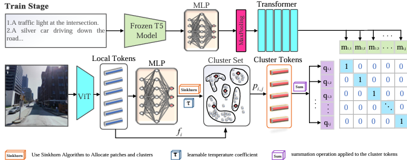

<p align="center">
Bridging Text and Vision: A Multi-View Text-Vision Registration Approach for Cross-Modal Place Recognition
</p>
<p align="center">
Qilu University of Technology (Shandong Academy of Sciences)
</p>

This is the official repository for Text4VPR ([paper](https://arxiv.org/pdf/2502.14195)), also see text4vpr in https://github.com/nuozimiaowu/Text4VPR. in detail. 🔥🔥🔥


## Introduction

We focus on the localization problem from pure text to images, specifically achieving accurate positioning through descriptions of the surrounding environment. Our text4VPR model addresses this issue for the first time by utilizing semantic information from multiple views of the same location. During the training phase, we employ contrastive learning with single image-text pairs, while in the inference phase, we match groups of descriptions and images from the same location to achieve precise localization. We are the first to tackle the localization problem from pure text descriptions to image groups and have introduced a dataset called Street360Loc. This dataset contains 7,000 locations, each with four images from different directions and corresponding rich textual descriptions. On Street360Loc, Text4VPR builds a robust baseline, achieving a top-1 accuracy of 52% and a top-10 accuracy of 92% within a 5-meter radius on the test set. This indicates that localization from textual descriptions to images is not only feasible but also holds significant potential for further advancement.

## Model and performance




Text4VPR. Training stage: We employ the T5 model to encode text descriptions. We implement the Sinkhorn algorithm to assign tags to clusters, followed by cluster aggregation to generate image encodings. Finally, we use contrastive learning to draw correctly matched image-text pairs closer in the embedding space. Inference stage: Both images and text are encoded with the same text and image encoders utilized during training. Subsequently, we align text clusters with their paired image clusters at corresponding positions.

</div>


<div align="center">
 **Performance evaluation by comparison with SOTA place recognition methods**
</div>
                

## Building Environment

Create a conda environment and install basic dependencies:

```
git clone https://github.com/nuozimiaowu/Text4VPR
cd Text4VPR

conda create -n text4vpr python=3.11.9
conda activate text4vpr

pip install torch torchvision torchaudio --index-url https://download.pytorch.org/whl/cu124
pip install xformers==0.0.28.post1
pip install pandas
pip install nltk
pip install transformers=4.44.2
pip install openpyxl
pip install protobuf
pip install tiktoken
pip install sentencepiece
```

## Dataset Construction

"Download `Street360Loc_images.rar` from https://drive.google.com/file/d/17QlkGvgAKIYlm6AHi6fjFTD8ev8eNVWB/view?usp=sharing. Extract it into the `dataset` folder. The structure of the `dataset` folder will be as follows:"


Dataset construction finished

## Load Pretrained Modules

Our pre-trained model is avaliable：https://drive.google.com/file/d/1ZH-lpOzsKPOMguwKcDcr0OlXUjwK427d/view?usp=sharing

To evaluate the pretrained model, follow these detailed steps:

1. **Open the Evaluation Script**: Navigate to the `test` directory and open the `test.py` script in a text editor.

2. **Update File Paths**: Locate the following lines in `test.py` and replace the placeholder paths with the actual paths to your test dataset and the trained model weights:

   ```
   excel_file_test = r"your path to /dataset/test_description.xlsx"
   image_root_dir = r"your path to /dataset/Street360Loc_images"
   ```

   For example:

   ```
   excel_file_test = r"/home/user/Text4VPR/dataset/test_description.xlsx"
   image_root_dir = r"/home/user/Text4VPR/dataset/Street360Loc_images"
   ```

3. **Update Model Weights Path**: Find and update the line specifying the model weight file path to point to the checkpoint saved during training:

   ```
   model_path = r'your downloaded pretraind model'
   ```

4. **Run the Evaluation Script**: After updating the paths, run the evaluation script. In your terminal, ensure you are in the root directory of the Text4VPR repository, and execute:
    ```
    python test/test.py
    ```
## Training

To train the Text4VPR model, follow these detailed steps:

1. **Open the Training Script**: Navigate to the `train` directory and open the `train.py` script in a text editor of your choice.

2. **Update File Paths**: Locate the following lines in `train.py` and replace the placeholder paths with the actual paths to your dataset:

   ```
   excel_file_train = r"your path to /dataset/train_description.xlsx"
   excel_file_val = r"your path to /dataset/val_description.xlsx"
   image_root_dir = r"your path to /dataset/Street360Loc_images"
   ```

   For example, if your dataset is located in `/home/user/Text4VPR/dataset`, the lines should look like this:

   ```
   excel_file_train = r"/home/user/Text4VPR/dataset/train_description.xlsx"
   excel_file_val = r"/home/user/Text4VPR/dataset/val_description.xlsx"
   image_root_dir = r"/home/user/Text4VPR/dataset/Street360Loc_images"
   ```

3. **Run the Training Script**: After updating the paths, you can run the training script. Open your terminal, ensure you are in the root directory of the Text4VPR repository, and execute the following command:

   ```
   python train/train.py
   ```

   The training process will begin, and you will see progress updates in the terminal.

4. **Model Checkpoint**: Once training is complete, the trained model will be saved in the `train/checkpoints` directory. You can find the model files there for later use.

## Evaluation

To evaluate the model, follow these detailed steps:

1. **Open the Evaluation Script**: Navigate to the `test` directory and open the `test.py` script in a text editor.

2. **Update File Paths**: Locate the following lines in `test.py` and replace the placeholder paths with the actual paths to your test dataset and the trained model weights:

   ```
   excel_file_test = r"your path to /dataset/test_description.xlsx"
   image_root_dir = r"your path to /dataset/Street360Loc_images"
   ```

   For example:

   ```
   excel_file_test = r"/home/user/Text4VPR/dataset/test_description.xlsx"
   image_root_dir = r"/home/user/Text4VPR/dataset/Street360Loc_images"
   ```

3. **Update Model Weights Path**: Find and update the line specifying the model weight file path to point to the checkpoint saved during training:

   ```
   model_path = r'your weight file path under train/checkpoints/'
   ```

   For example:

   ```
   model_path = r"/home/user/Text4VPR/train/checkpoints/your_model_weights.pth"
   ```

4. **Run the Evaluation Script**: After updating the paths, run the evaluation script. In your terminal, ensure you are in the root directory of the Text4VPR repository, and execute:

   ```
   python test/test.py
   ```

   The evaluation process will commence, and you will see the evaluation results printed in the terminal.

Following these steps will enable you to successfully train and evaluate the Text4VPR model using your dataset.
